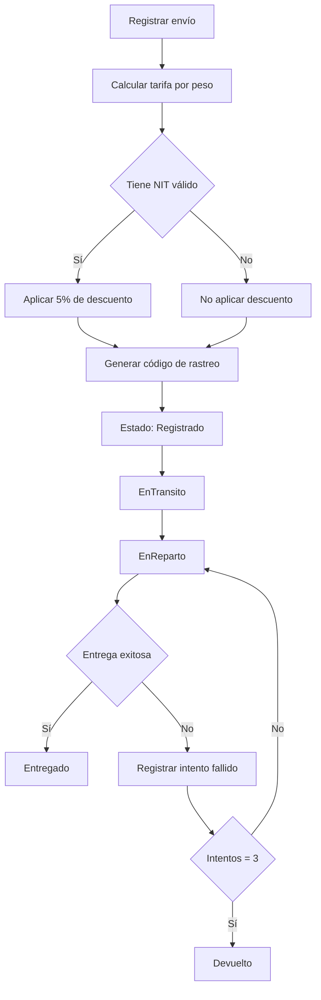
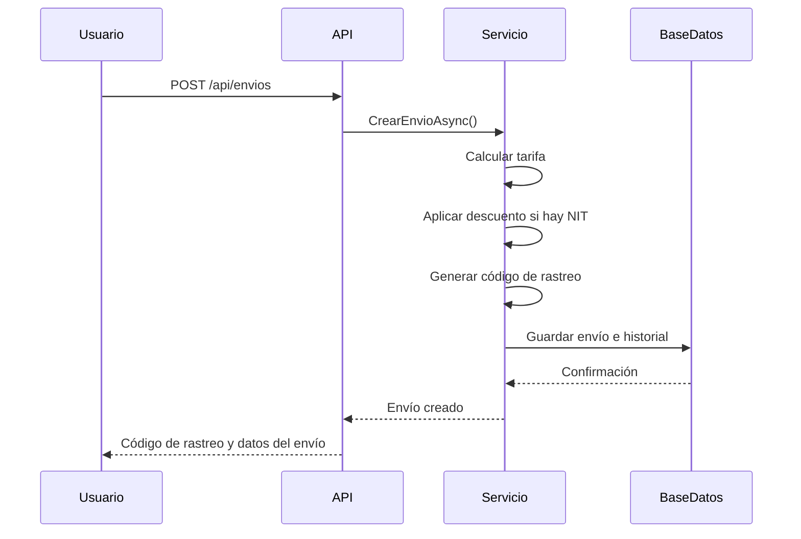

# ExamenFinalAnalisis
Fredy Anibal Cardona Montenegro 0907-23-22830

# Envíos Rápidos GT - Sistema de Gestión de Envíos

## Descripción del proyecto

Este proyecto fue desarrollado para el examen final del curso **Análisis de Sistemas I**.
El sistema corresponde a una solución para la empresa ficticia **Envíos Rápidos GT**, dedicada a la logística y paquetería en Guatemala.

Actualmente, la empresa realiza el seguimiento de envíos de forma manual, lo cual provoca pérdida de información, dificultad para consultar el estado de los paquetes, problemas para controlar intentos de entrega y poca eficiencia en la generación de reportes.

La solución propuesta consiste en una **API REST desarrollada en ASP.NET Core**, que permite registrar envíos, calcular tarifas automáticamente, generar códigos de rastreo, actualizar estados, guardar historial de movimientos y consultar reportes de eficiencia.

---

## Objetivo general

Desarrollar un sistema backend funcional que permita gestionar envíos de paquetes, controlar su estado, registrar historial de cambios y mejorar el seguimiento de entregas mediante una API REST.

---

## Problema identificado

La empresa Envíos Rápidos GT necesita una solución para:

* Registrar envíos de forma ordenada.
* Calcular tarifas según el peso del paquete.
* Generar automáticamente códigos de rastreo.
* Consultar el estado actual de cada envío.
* Registrar la ubicación donde se actualiza cada estado.
* Controlar intentos fallidos de entrega.
* Cambiar automáticamente un envío a Devuelto después de 3 intentos fallidos.
* Generar reportes de eficiencia.

---

## Tecnologías utilizadas

* C#
* .NET 10
* ASP.NET Core Web API
* Entity Framework Core
* SQLite
* xUnit
* Visual Studio Code
* GitHub

---

## Reglas de negocio implementadas

### 1. Cálculo automático de tarifa

La tarifa del envío se calcula automáticamente según el peso del paquete:

| Peso del paquete | Tarifa  |
| ---------------- | ------- |
| Menor a 1 kg     | Q25.00  |
| 1.01 kg a 5 kg   | Q45.00  |
| 5.01 kg a 10 kg  | Q75.00  |
| Mayor a 10 kg    | Q100.00 |

---

### 2. Descuento por NIT

Si el remitente o destinatario tiene un NIT válido, se aplica un **5% de descuento** sobre la tarifa calculada.

---

### 3. Código de rastreo automático

Cada envío genera automáticamente un código de rastreo con el siguiente formato:

```txt
ENV-YYYYMMDD-XXXX
```

Ejemplo:

```txt
ENV-20260613-1234
```

---

### 4. Estados permitidos

Los estados de un envío solo pueden avanzar en el siguiente orden:

```txt
Registrado -> EnTransito -> EnReparto -> Entregado
```

También se permite devolver un envío desde los siguientes estados:

```txt
EnTransito -> Devuelto
EnReparto -> Devuelto
```

No se permite saltar estados. Por ejemplo, no se puede pasar directamente de **Registrado** a **Entregado**.

---

### 5. Intentos de entrega

El sistema permite un máximo de **3 intentos de entrega**.

Al fallar el tercer intento, el envío cambia automáticamente al estado:

```txt
Devuelto
```

---

### 6. Historial de estados

Cada vez que se cambia el estado de un envío, el sistema registra automáticamente:

* Estado nuevo.
* Ubicación donde se realizó el cambio.
* Fecha y hora del cambio.
* Nota opcional.

---

## Módulos del sistema

* Gestión de envíos.
* Control de estados.
* Historial de movimientos.
* Intentos de entrega.
* Reportes de eficiencia.
* Pruebas unitarias.

---

## Endpoints principales

### Crear envío

```http
POST /api/envios
```

Body de ejemplo:

```json
{
  "remitente": "Juan Perez",
  "destinatario": "Maria Lopez",
  "nitRemitente": "1234567",
  "nitDestinatario": "",
  "pesoKg": 4.5,
  "ubicacionInicial": "Guatemala"
}
```

---

### Listar envíos

```http
GET /api/envios
```

---

### Consultar envío por código

```http
GET /api/envios/{codigo}
```

---

### Actualizar estado

```http
PUT /api/envios/{codigo}/estado
```

Body de ejemplo:

```json
{
  "nuevoEstado": 2,
  "ubicacion": "Centro de distribucion Guatemala",
  "nota": "Paquete salio de oficina central"
}
```

Estados disponibles:

```txt
1 = Registrado
2 = EnTransito
3 = EnReparto
4 = Entregado
5 = Devuelto
```

---

### Registrar intento fallido

```http
POST /api/envios/{codigo}/intento-fallido
```

Body de ejemplo:

```json
{
  "ubicacion": "Sanarate",
  "nota": "No contestaron"
}
```

---

### Consultar historial

```http
GET /api/envios/{codigo}/historial
```

---

### Reporte de eficiencia

```http
GET /api/reportes/eficiencia
```

---

### Verificar funcionamiento de la API

```http
GET /health
```

---

## Historias de usuario

### HU-01: Registro de envíos

Como: Usuario del sistema
Quiero: registrar un nuevo envío con datos del remitente, destinatario, peso y ubicación inicial
Para: llevar un control digital de los paquetes que ingresan a la empresa.

Descripción:
El sistema debe permitir registrar envíos nuevos y guardar la información principal del paquete. Al crear el envío, se debe calcular automáticamente la tarifa, aplicar descuento si corresponde y generar un código de rastreo.

Criterios de aceptación:

1. Dado que el usuario ingresa todos los datos obligatorios, cuando registra el envío, entonces el sistema debe guardar el envío correctamente.
2. Dado que el peso ingresado es válido, cuando se registra el envío, entonces el sistema debe calcular automáticamente la tarifa.
3. Dado que el remitente o destinatario tiene NIT válido, cuando se registra el envío, entonces el sistema debe aplicar un 5% de descuento.

Prioridad: Alta

Módulo relacionado:
Envíos

Notas técnicas:
Endpoint: POST /api/envios.

---

### HU-02: Generación automática de código de rastreo

Como: Usuario del sistema
Quiero: que el sistema genere automáticamente un código de rastreo
Para: identificar cada envío de forma única.

Descripción:
Cada envío debe contar con un código único generado automáticamente con el formato establecido. Este código permitirá consultar el estado y el historial del paquete.

Criterios de aceptación:

1. Dado que se registra un nuevo envío, cuando el sistema guarda la información, entonces debe generar un código de rastreo.
2. Dado que el código se genera correctamente, cuando se consulta el envío, entonces debe mostrarse con el formato ENV-YYYYMMDD-XXXX.
3. Dado que ya existe un código generado, cuando se crea otro envío, entonces el nuevo código no debe repetirse.

Prioridad: Alta

Módulo relacionado:
Envíos

Notas técnicas:
Formato requerido: ENV-YYYYMMDD-XXXX.

---

### HU-03: Cálculo de tarifa por peso

Como: Usuario del sistema
Quiero: que el sistema calcule la tarifa según el peso del paquete
Para: evitar errores manuales al cobrar el envío.

Descripción:
El sistema debe calcular automáticamente el costo del envío dependiendo del peso ingresado. Esto permite que la tarifa sea consistente y se aplique según las reglas definidas.

Criterios de aceptación:

1. Dado que el peso es menor a 1 kg, cuando se registra el envío, entonces la tarifa debe ser Q25.00.
2. Dado que el peso está entre 1.01 kg y 5 kg, cuando se registra el envío, entonces la tarifa debe ser Q45.00.
3. Dado que el peso es mayor a 10 kg, cuando se registra el envío, entonces la tarifa debe ser Q100.00.

Prioridad: Alta

Módulo relacionado:
Envíos / Tarifas

Notas técnicas:
La lógica se encuentra en el servicio EnvioService.

---

### HU-04: Aplicación de descuento por NIT

Como: Usuario del sistema
Quiero: aplicar un descuento cuando el remitente o destinatario tenga NIT válido
Para: cumplir con la regla comercial establecida por la empresa.

Descripción:
El sistema debe validar si el remitente o destinatario tiene NIT válido. Si existe un NIT válido, se aplica automáticamente un 5% de descuento sobre la tarifa calculada.

Criterios de aceptación:

1. Dado que el remitente tiene NIT válido, cuando se registra el envío, entonces el sistema debe aplicar el descuento.
2. Dado que el destinatario tiene NIT válido, cuando se registra el envío, entonces el sistema debe aplicar el descuento.
3. Dado que ninguno tiene NIT válido, cuando se registra el envío, entonces no debe aplicarse descuento.

Prioridad: Media

Módulo relacionado:
Envíos / Tarifas

Notas técnicas:
Validación implementada en EnvioService.

---

### HU-05: Consulta de envío por código de rastreo

Como: Cliente o usuario del sistema
Quiero: consultar un envío mediante su código de rastreo
Para: conocer el estado actual del paquete.

Descripción:
El sistema debe permitir buscar un envío por su código de rastreo y mostrar la información actual del paquete, incluyendo estado, ubicación, tarifa y datos principales.

Criterios de aceptación:

1. Dado que existe un envío con el código ingresado, cuando el usuario realiza la consulta, entonces el sistema debe mostrar la información del envío.
2. Dado que el código no existe, cuando el usuario realiza la consulta, entonces el sistema debe mostrar un mensaje de no encontrado.
3. Dado que el envío tiene historial, cuando se consulta el envío, entonces debe poder visualizarse la información relacionada.

Prioridad: Alta

Módulo relacionado:
Envíos

Notas técnicas:
Endpoint: GET /api/envios/{codigo}.

---

### HU-06: Actualización de estado del envío

Como: Usuario del sistema
Quiero: actualizar el estado de un envío
Para: reflejar el avance real del paquete durante el proceso de entrega.

Descripción:
El sistema debe permitir cambiar el estado de un envío siempre que la transición sea válida. Cada cambio debe guardar la ubicación y una nota opcional.

Criterios de aceptación:

1. Dado que un envío está en Registrado, cuando se actualiza a EnTransito, entonces el sistema debe permitir el cambio.
2. Dado que un envío está en EnTransito, cuando se actualiza a EnReparto, entonces el sistema debe permitir el cambio.
3. Dado que se intenta saltar de Registrado a Entregado, cuando se actualiza el estado, entonces el sistema debe rechazar la operación.

Prioridad: Alta

Módulo relacionado:
Estados / Envíos

Notas técnicas:
Endpoint: PUT /api/envios/{codigo}/estado.

---

### HU-07: Registro de historial de cambios

Como: Supervisor
Quiero: que cada cambio de estado quede guardado en el historial
Para: tener trazabilidad del recorrido del paquete.

Descripción:
Cada actualización de estado debe generar un registro histórico con estado, ubicación, fecha y nota. Esto permite revisar todos los movimientos realizados sobre el envío.

Criterios de aceptación:

1. Dado que se registra un envío, cuando se crea correctamente, entonces debe guardarse el primer historial con estado Registrado.
2. Dado que se actualiza el estado del envío, cuando el cambio es válido, entonces debe agregarse un nuevo registro al historial.
3. Dado que se consulta el historial de un envío, cuando existen registros, entonces el sistema debe mostrarlos ordenados por fecha.

Prioridad: Alta

Módulo relacionado:
Historial / Envíos

Notas técnicas:
Endpoint: GET /api/envios/{codigo}/historial.

---

### HU-08: Control de intentos fallidos de entrega

Como: Supervisor
Quiero: registrar intentos fallidos de entrega
Para: controlar cuántas veces se intentó entregar un paquete.

Descripción:
El sistema debe permitir registrar intentos fallidos cuando un envío está en estado EnReparto. Cada intento debe aumentar el contador de intentos y guardarse en el historial.

Criterios de aceptación:

1. Dado que un envío está en EnReparto, cuando se registra un intento fallido, entonces el sistema debe aumentar el contador de intentos.
2. Dado que un envío no está en EnReparto, cuando se intenta registrar un intento fallido, entonces el sistema debe rechazar la operación.
3. Dado que se registra un intento fallido, cuando se guarda la información, entonces debe agregarse una nota al historial.

Prioridad: Alta

Módulo relacionado:
Intentos de entrega / Envíos

Notas técnicas:
Endpoint: POST /api/envios/{codigo}/intento-fallido.

---

### HU-09: Devolución automática por tercer intento fallido

Como: Supervisor
Quiero: que el sistema cambie automáticamente el envío a Devuelto después de tres intentos fallidos
Para: cumplir con la regla de negocio establecida.

Descripción:
El sistema debe controlar el número máximo de intentos de entrega. Al llegar al tercer intento fallido, el estado del envío debe cambiar automáticamente a Devuelto.

Criterios de aceptación:

1. Dado que un envío tiene dos intentos fallidos, cuando se registra un tercer intento, entonces el estado debe cambiar a Devuelto.
2. Dado que el envío cambia a Devuelto automáticamente, cuando se consulta el historial, entonces debe aparecer una nota indicando la devolución.
3. Dado que el envío ya está Devuelto, cuando se intenta registrar otro cambio inválido, entonces el sistema debe impedirlo.

Prioridad: Alta

Módulo relacionado:
Intentos de entrega / Estados

Notas técnicas:
La lógica está implementada en RegistrarIntentoFallidoAsync.

---

### HU-10: Reporte de eficiencia de entregas

Como: Administrador
Quiero: consultar un reporte de eficiencia
Para: conocer la cantidad de envíos entregados, devueltos y el porcentaje de eficiencia.

Descripción:
El sistema debe generar un reporte general que muestre el total de envíos registrados, la cantidad de entregados, la cantidad de devueltos y el porcentaje de eficiencia.

Criterios de aceptación:

1. Dado que existen envíos registrados, cuando el administrador consulta el reporte, entonces el sistema debe mostrar el total de envíos.
2. Dado que existen envíos entregados, cuando se genera el reporte, entonces el sistema debe calcular el porcentaje de eficiencia.
3. Dado que no existen envíos registrados, cuando se consulta el reporte, entonces la eficiencia debe ser 0%.

Prioridad: Media

Módulo relacionado:
Reportes

Notas técnicas:
Endpoint: GET /api/reportes/eficiencia.

---

## Pruebas unitarias

El proyecto cuenta con pruebas unitarias desarrolladas con **xUnit**.

Para ejecutar las pruebas:

```bash
dotnet test
```

Resultado obtenido:

```txt
Total de pruebas: 12
Correctas: 12
Errores: 0
Omitidas: 0
```

### Pruebas realizadas

* Cálculo de tarifa para peso menor a 1 kg.
* Cálculo de tarifa para peso entre 1 kg y 5 kg.
* Cálculo de tarifa para peso entre 5 kg y 10 kg.
* Cálculo de tarifa para peso mayor a 10 kg.
* Validación de peso inválido.
* Aplicación de descuento por NIT válido.
* Validación de envío sin descuento.
* Generación de código de rastreo.
* Estado inicial Registrado.
* Validación de transición inválida.
* Registro de historial al actualizar estado.
* Devolución automática al tercer intento fallido.

---

## Cómo ejecutar el proyecto localmente

Desde la carpeta raíz del proyecto:

```bash
dotnet build
```

Luego ejecutar la API:

```bash
cd EnviosRapidosGT.Api
dotnet run
```

La API se ejecuta en una URL similar a:

```txt
http://localhost:5173
```

Para verificar que funciona:

```http
GET /health
```

Respuesta esperada:

```json
{
  "status": "ok"
}
```

---

## Estructura del proyecto

```txt
ExamenFinal-Analisis/
│
├── EnviosRapidosGT.Api/
│   ├── Controllers/
│   │   └── EnviosController.cs
│   ├── Data/
│   │   └── AppDbContext.cs
│   ├── Dtos/
│   │   └── EnvioDtos.cs
│   ├── Models/
│   │   ├── Envio.cs
│   │   └── HistorialEnvio.cs
│   ├── Services/
│   │   └── EnvioService.cs
│   └── Program.cs
│
├── EnviosRapidosGT.Tests/
│   └── EnvioServiceTests.cs
│
├── README.md
└── EnviosRapidosGT.sln
```

---

## Diagrama de flujo del proceso



---

## Diagrama de secuencia



---

## Uso de Inteligencia Artificial

Durante el desarrollo del proyecto se utilizó apoyo de inteligencia artificial para organizar la solución, generar ideas, revisar errores y documentar el sistema.

### Prompts utilizados

1. Ayúdame a analizar este examen y organizar el proyecto paso por paso.
2. Ayúdame a crear una API REST para una empresa de envíos y paquetería.
3. Crea la lógica para calcular tarifas según peso.
4. Ayúdame a validar los estados permitidos de un envío.
5. Crea pruebas unitarias con xUnit para validar las reglas del sistema.
6. Ayúdame a corregir errores de ejecución en la terminal.
7. Genera documentación para el README del proyecto.
8. Ayúdame a redactar historias de usuario para el sistema.

### Reflexión sobre el uso de IA

La inteligencia artificial fue utilizada como herramienta de apoyo para acelerar el desarrollo y organizar mejor el trabajo.
Sin embargo, el proyecto fue probado manualmente mediante la terminal y se verificó que la API funcionara correctamente antes de documentarlo.

La IA ayudó principalmente en:

* Estructura inicial del proyecto.
* Redacción de historias de usuario.
* Corrección de errores.
* Generación de pruebas unitarias.
* Documentación técnica.

---

## Evidencia de funcionamiento

El proyecto fue probado localmente mediante la terminal y se validaron los siguientes puntos:

* La API inicia correctamente.
* El endpoint `/health` responde correctamente.
* Se pueden crear envíos.
* Se pueden actualizar estados.
* Se genera historial.
* Se genera reporte de eficiencia.
* Las pruebas unitarias se ejecutan correctamente.

Resultado de pruebas:

```txt
Resumen de pruebas:
total: 12
errores: 0
correcto: 12
omitido: 0
```

---

## Conclusión

El sistema desarrollado permite resolver el problema principal de Envíos Rápidos GT, ya que digitaliza el registro de paquetes, automatiza el cálculo de tarifas, genera códigos de rastreo, controla el flujo de estados, registra historial y permite obtener reportes de eficiencia.

La solución cumple con los requerimientos principales del examen y demuestra el uso de análisis, diseño, implementación, pruebas y documentación.

---

## Autor

Proyecto realizado para el examen final de **Análisis de Sistemas I**.

Universidad Mariano Gálvez de Guatemala
Facultad de Ingeniería
Centro Universitario de Jalapa
